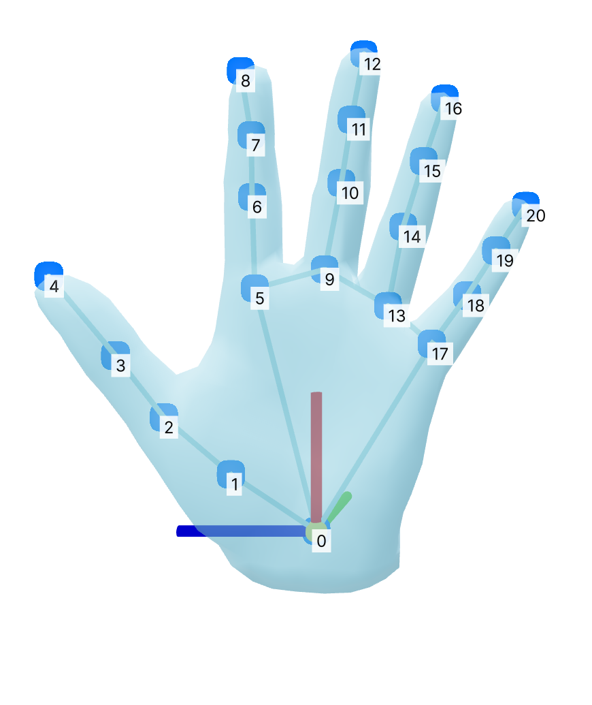
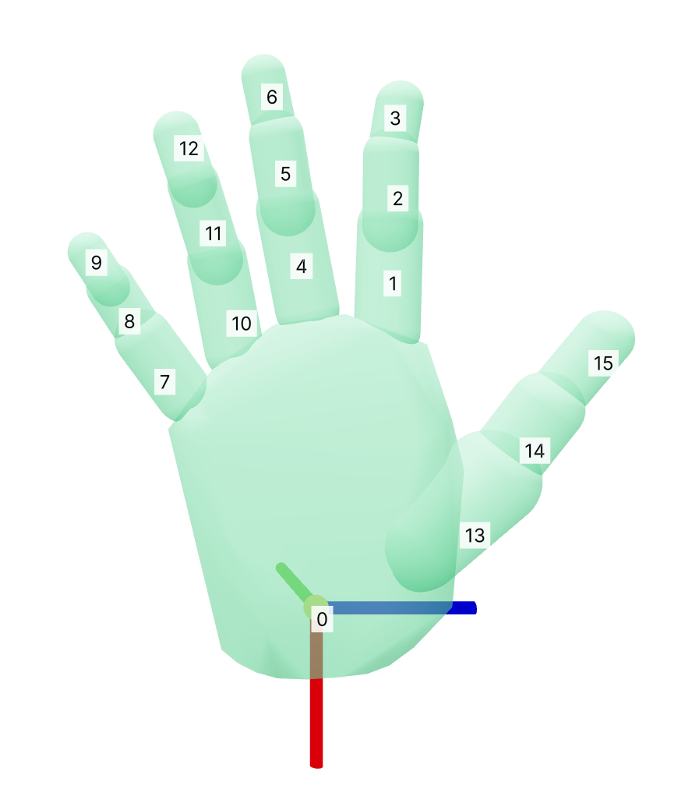

# manosim

MANO hand models in MJCF format for MuJoCo simulation.

<p align="center">
  
  <br/>
  <em>Hand models from manosim in <a href="https://grasping.io/">Human Universal Grasping</a>.</em>
</p>

Each build produces two representations of the same hand:

- ***Mesh hand*** - One convex-hull geom per bone, closely matching the MANO surface.
- ***Capsule hand*** - One capsule per phalanx with a mesh palm.

> [!TIP]
> In practice, use the capsule hand for better contacts (smooth normals, faster collision queries).

## Quick Start

**1) Clone and install dependencies**

```bash
git clone https://github.com/KevinyWu/manosim.git && cd manosim
conda env create -f environment.yaml && conda activate manosim
pip install --no-build-isolation git+https://github.com/mattloper/chumpy.git@580566e
pip install -e .
```

**2) Download MANO models**

[Register](https://mano.is.tue.mpg.de/) → download and unzip the MANO models → copy contents of `mano_v*_*/` to `assets/mano_models/`

**3) Build the MJCFs, then view them in simulation**

```bash
python -m manosim.build_mjcf
python -m manosim.visualize_hand
```

## Configuration

Each hand variant is defined by a single YAML config. The config carries a `name` (used as the output folder under `assets/`), an optional `shape` list or `shape_file` for hand shape, and all build-time knobs (mass, actuator gains, etc.). To make a custom hand, pass a config file with `--config`.

> [!IMPORTANT]
> `shape` and `shape_file` are interpreted as right-hand MANO shape params. The left hand is built by mirroring the shape basis x-axis.

Two examples ship in `config/`. Note that `myhand` is the hand shape used in [Human Universal Grasping](https://grasping.io/).

```bash
# Default (myhand)
python -m manosim.build_mjcf
python -m manosim.visualize_hand

# Zero-shape hand
python -m manosim.build_mjcf --config config/zerohand.yaml
python -m manosim.visualize_hand --config config/zerohand.yaml
```

**A note on solver parameters**

Simulating human hands with rigid-body physics is difficult, since human hands have soft tissue and are naturally compliant. Two [solver parameters](https://mujoco.readthedocs.io/en/stable/modeling.html#solver-parameters), `solimp` and `solref`, are particularly important for making the hand feel realistic. In our work [Human Universal Grasping](https://grasping.io/), we selected `solimp: "0.5 0.95 0.001"` (with an even softer palm `solimp: "0.005 0.9 0.025"`) and `solref: "0.04 1"`, softer than the MuJoCo defaults of `"0.9 0.95 0.001"` and `"0.02 1"`. We determined these by replaying recorded human demonstrations, which serve as ground truth: a grasp a human performed should also succeed in simulation. These parameters show a high sim/real correlation, which was the desired outcome. However, you may observe that the hand sometimes penetrates objects. To counter this, you could make the hand very stiff with `solimp: "0.99 0.9999 0.0005"` and `solref: "0.004 1"`, which reduces interpenetration but at a large cost to sim/real correlation (only ~45% of recorded human grasps succeeded with this stiff hand, compared to >90% with the parameters we selected).

## Hand and Wrist Conventions

<table align="center">
  <tr>
    <td width="50%" align="center"></td>
    <td width="50%" align="center"></td>
  </tr>
  <tr>
    <td align="center"><b>MANO Mesh Hand (Left)</b></td>
    <td align="center"><b>manosim Capsule Hand (Right)</b></td>
  </tr>
</table>

The images above show the 21 MANO landmarks (left) and the 16-bone kinematic tree (right) from which the MJCF is built. Bodies (`mano_body_{i}`), meshes (`mano_bone_{i}`), and finger joints (`mano_joint_{i}`) all share this bone order. The wrist has three slide joints (`wrist_tx/ty/tz`) plus a ball joint (`wrist_rot`); every finger joint is a ball joint.

**Wrist frame convention**

| Direction | Left MANO | Right MANO |
| --- | --- | --- |
| Wrist → middle | +X | -X |
| Palm normal | -Y | -Y |
| Wrist → thumb | +Z | +Z |

## Citation

If you use manosim, please cite our paper [Human Universal Grasping](https://grasping.io/), which manosim is originally developed for:

```bibtex
@article{wu2026hug,
    title={Human Universal Grasping},
    author={Kevin Yuanbo Wu and Tianxing Zhou and Isaac Tu and Billy Yan and Irmak Guzey and David Fouhey and Dandan Shan and Lerrel Pinto},
    journal={arXiv preprint arXiv:2606.17054},
    year={2026}
}
```

Please also cite [manotorch](https://github.com/lixiny/manotorch), and the original [MANO](https://mano.is.tue.mpg.de/) paper:

```bibtex
@inproceedings{yang2021cpf,
    title = {{CPF}: Learning a Contact Potential Field to Model the Hand-Object Interaction},
    author = {Yang, Lixin and Zhan, Xinyu and Li, Kailin and Xu, Wenqiang and Li, Jiefeng and Lu, Cewu},
    booktitle = {ICCV},
    year = {2021}
}

@article{MANO:SIGGRAPHASIA:2017,
    title = {Embodied Hands: Modeling and Capturing Hands and Bodies Together},
    author = {Romero, Javier and Tzionas, Dimitrios and Black, Michael J.},
    journal = {ACM Transactions on Graphics, (Proc. SIGGRAPH Asia)},
    volume = {36},
    number = {6},
    series = {245:1--245:17},
    month = nov,
    year = {2017},
    month_numeric = {11}
}
```
